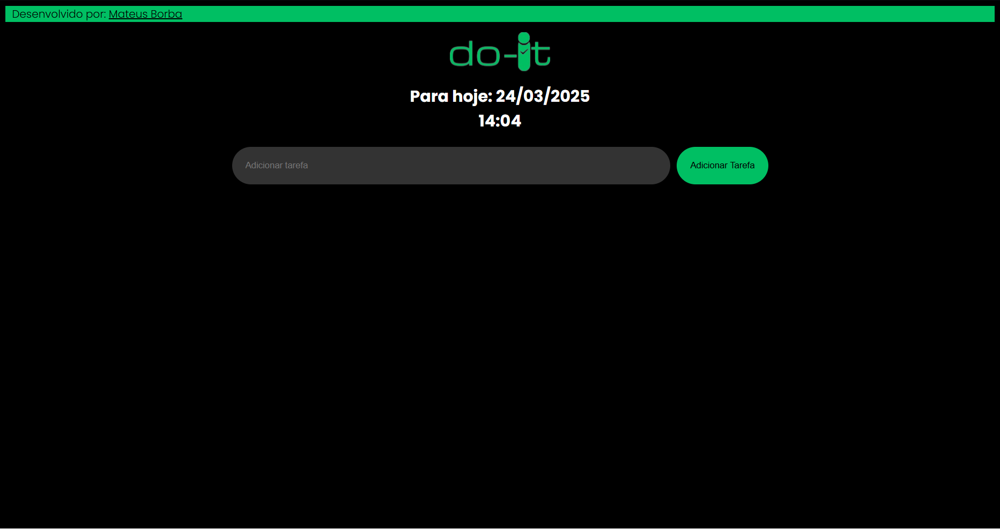
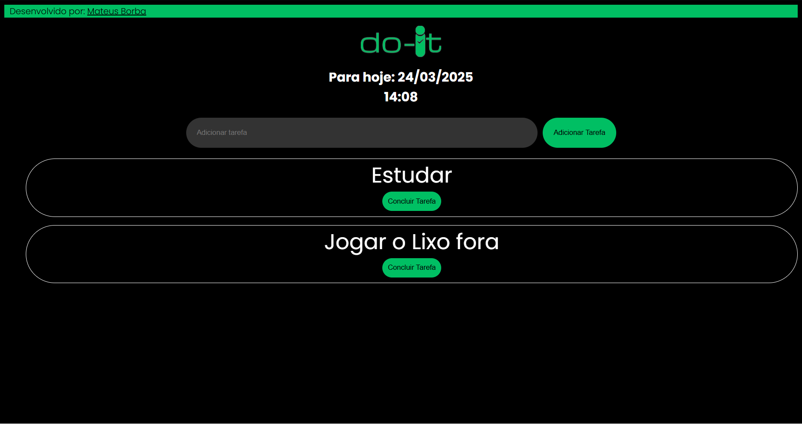

  

<h2>Descrição</h2>

Do-It é uma página web simples e eficiente para gerenciamento de tarefas. Ele permite que você organize suas tarefas diárias, visualize a data e hora atual e gerencie suas tarefas de forma intuitiva.

<h2>Funcionalidades</h2>

<ul>
    <li>Adicionar, editar e remover tarefas.</li>
    <li>Visualização da data e hora atual em tempo real.</li>
    <li>Persistência de dados usando <code>localStorage</code>.</li>
    <li>Interface simples e fácil de usar.</li>
</ul>

<h2>Tecnologias Utilizadas</h2>

<ul>
    <li>HTML</li>
    <li>CSS</li>
    <li>JavaScript</li>
</ul>

  <h2>Como Utilizar?</h2>

<ol>
    <li>Link para acessar o Do-It</li>
    <pre><code>http://doitbr.site/</code></pre>
</ol>

<h2>Estrutura de Pastas</h2>

<pre><code>
do-it/
├── index.html     # Página inicial do aplicativo
├── styles.css     # Folhas de estilo CSS
├── script.js      # Arquivos JavaScript
└── README.html     # Este arquivo
    </code></pre>

<h2>Autor</h2>

<h3>Mateus Borba</h3>

  
  
  

<h2>Imagem do Aplicativo</h2>

  
  

